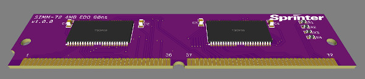
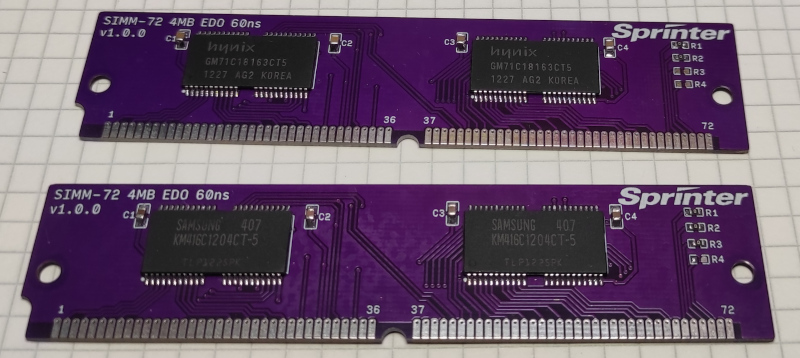

# Модуль памяти SIMM-72
## Модуль версии 1.1

В данном репозитории представлен проект модуля памяти, стандарта SIMM-72 pin.
Модуль имеет 2 чипа памяти EDO GM71C18163CT6, емкостью 1Mx16bit со временем доступа 60ns.

Особенности Версии 1.1
* Добавлен опциональный стабилизатор напряжения для питания чипов памяти на 3,3В. Если используются обычные чипы памяти, с питанием 5В, стабилизатор D3 устанавливать не нужно, но нужно запаять перемычку J1.
* Уменьшена высота модуля на 2мм.
* Все резисторы имеют размер 0805 вместо 0603.
* Конденсаторы размещены более свободно, для удобства монтажа.

Общий объем модуля 4MB.

[Исходники](Sources)

[Готовые схемы](Export)

[Герберы](Gerber) При заказе __учитывайте__, что оригинальные модули имели толщину текстолита __1,27±0,1мм__.

В настоящий момент, собрано и эксплуатируется несколько рабочих модулей версии 1.0.

Модули версии 1.1 еще не изготавливались.
